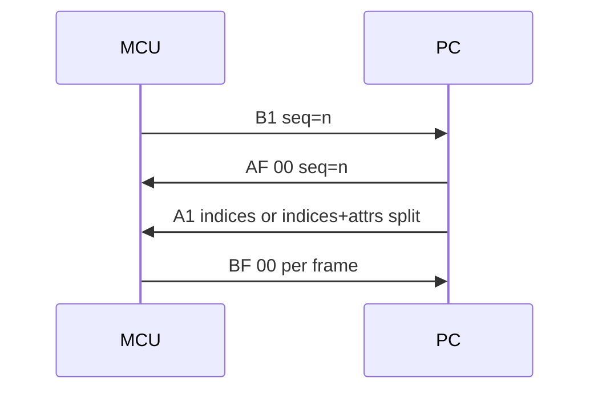
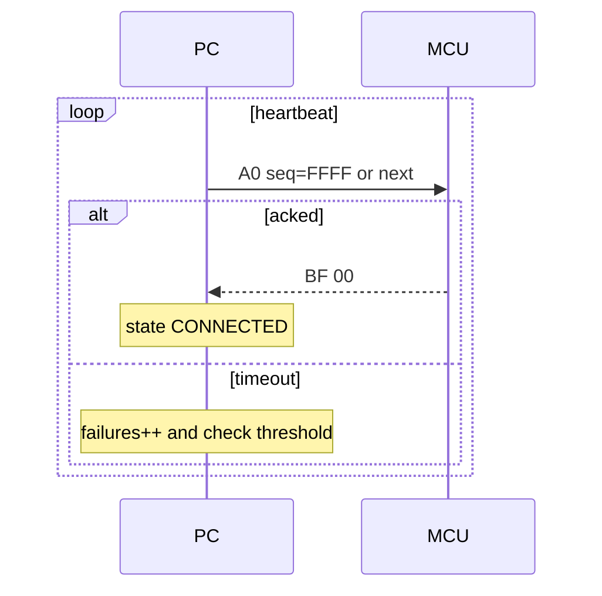
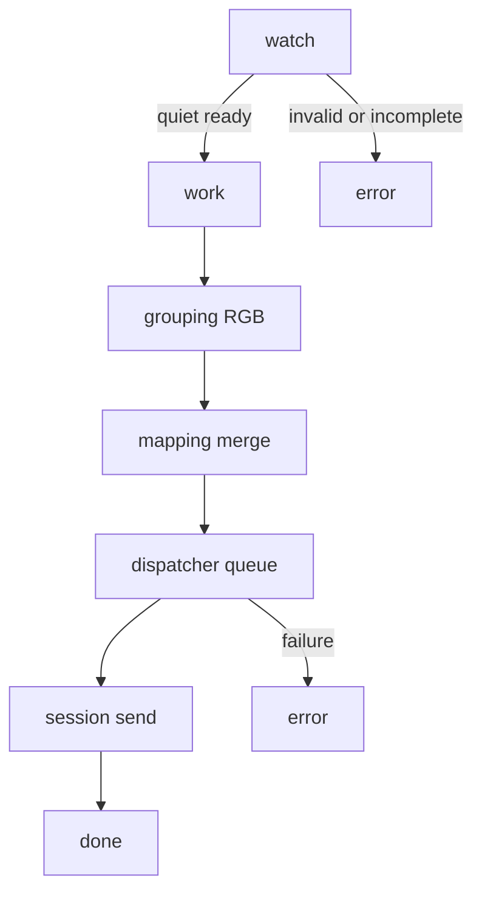

# 架构说明 - Material Identification Upper Computer

总览
- 上位机以串口为边界，封装协议帧与会话状态机；业务侧以文件为驱动，完成入库、分组三色、映射、派发，下发到下位机的 WS2812 控制。
- 架构分层：协议层、会话层、业务层（入库/分组/映射/派发）、设备与串口抽象、配置与日志。

组件与职责
- 协议层：编码解码帧、构造 A0/A1/AF、错误校验与类型枚举。参见 [encode_frame()](app/comm/protocol.py:49)、[decode_stream()](app/comm/protocol.py:62)、[build_a0()](app/comm/protocol.py:112)、[build_a1()](app/comm/protocol.py:115)、[build_af()](app/comm/protocol.py:134)、[FrameType](app/comm/protocol.py:16)、[AckCode](app/comm/protocol.py:24)。
- 会话层：串口收发、SEQ 与 ACK 管控、重试与回退、心跳调度、B1 幂等与乱序处理、A1 分片。参见 [SerialSession](app/comm/session.py:28)、[send_and_wait_ack()](app/comm/session.py:139)、[start_heartbeat()](app/comm/session.py:194)、[stop_heartbeat()](app/comm/session.py:221)、[_handle_frame()](app/comm/session.py:250)、[_send_a1_payload()](app/comm/session.py:296)。
- 业务层：
  - 文件入库：watch→work/error 原子剪切，安静窗口过滤半写。参见 [FileIngressService](app/business/file_ingress.py:12)、[ingest_batch()](app/business/file_ingress.py:36)、[_safe_move()](app/business/file_ingress.py:115)。
  - 分组：按 -N1/N2/N3 聚合为 R/G/B 三色组。参见 [GroupingService](app/business/grouping.py:20)、[GroupTriplet](app/business/grouping.py:12)。
  - 映射：解析索引与可选百分比，蛇形重排与闪烁 attrs 生成。参见 [serpentine_map()](app/business/mapping.py:35)、[compose_indices_for_group()](app/business/mapping.py:59)、[parse_indices_and_percent_from_txt()](app/business/mapping.py:76)、[compose_indices_and_attrs_for_group()](app/business/mapping.py:107)。
  - 派发：队列化弹组，合成 indices 与可选 attrs。参见 [Dispatcher](app/business/dispatcher.py:13)、[request_next_payload()](app/business/dispatcher.py:35)、[archive_pending()](app/business/dispatcher.py:59)。
- 串口与设备：抽象串口以便测试替身；多设备管理与会话注册。参见 [SerialPortBase](app/comm/serial_port.py:4)、[FakeSerialPort](app/comm/serial_port.py:26)、[DeviceManager](app/comm/device_manager.py:9)、[attach()](app/comm/device_manager.py:13)。
- 配置与日志：JSON 配置仓库与日志体系。参见 [ConfigRepo](app/storage/config.py:7)、[load()](app/storage/config.py:13)、[_apply_defaults()](app/storage/config.py:22)、[get_logger()](app/logs/logger.py:24)、[hex_dump()](app/logs/logger.py:61)。

源代码路径总览
- 协议层与枚举：[app/comm/protocol.py](app/comm/protocol.py)
- 会话与状态机：[app/comm/session.py](app/comm/session.py)
- 串口抽象与设备管理：[app/comm/serial_port.py](app/comm/serial_port.py)、[app/comm/device_manager.py](app/comm/device_manager.py)
- 业务：文件入库/分组/映射/派发：[app/business/file_ingress.py](app/business/file_ingress.py)、[app/business/grouping.py](app/business/grouping.py)、[app/business/mapping.py](app/business/mapping.py)、[app/business/dispatcher.py](app/business/dispatcher.py)
- 配置与日志：[app/storage/config.py](app/storage/config.py)、[app/logs/logger.py](app/logs/logger.py)
- 应用入口与默认配置：[app/main.py](app/main.py)、[configs/default.json](configs/default.json)
- 打印设备占位：[app/devices/printer.py](app/devices/printer.py)
- 行为契约测试：[tests/](tests/)

关键技术决策
- 协议 CHECK：对 TYPE+LEN(LE)+SEQ(LE)+VAL 求和取低8位；未知 TYPE 或 CHECK 错误由会话层回 AF(code)。
- SEQ 与幂等：重复 B1 仅回 AF(DUPLICATE)，不重复下发 A1；乱序小于 expected 回 0x03，大于 expected 回 0x04。
- A1 载荷兼容：默认 2B index；当提供 attrs 时每项 3B(index+flags)，保持向后兼容；分片时 attrs 与 indices 片内对齐。
- 心跳调度：后台线程以固定周期发送 A0；在线判定以收到任意 BF 成功为准；连续失败达到阈值置 OFFLINE，成功后自动恢复 CONNECTED。
- 重试与回退：ACK 等待由 comm.retry.* 配置驱动，可配置 ack_timeout_ms、max_attempts、backoff_ms；心跳线程内关闭重试保持节奏。
- 文件原子性：watch→work/error 使用 os.replace 原子剪切；安静窗口 ready_quiet_ms 过滤半写文件。
- 映射策略：R→G→B 顺序合并；可选蛇形映射以匹配物理布线；当启用 blink 并解析到百分比超过阈值，置 attrs bit0。
- 日志可观测性：hex.capture 控制 TX/RX HEX 日志；级别与轮转、格式可配置。

运行时数据流与序列
B1 请求派发时序

心跳调度与在线判定

文件流水线

关键实现路径与接口
- 协议层
  - 编码解码：[encode_frame()](app/comm/protocol.py:49)、[decode_stream()](app/comm/protocol.py:62)
  - 构造器：[build_a0()](app/comm/protocol.py:112)、[build_a1()](app/comm/protocol.py:115)、[build_af()](app/comm/protocol.py:134)
  - 类型与应答码：[FrameType](app/comm/protocol.py:16)、[AckCode](app/comm/protocol.py:24)
- 会话层
  - 入口与状态：[SerialSession](app/comm/session.py:28)、[SessionState](app/comm/session.py:22)
  - B1 处理：[_handle_frame()](app/comm/session.py:250)
  - A1 分片发送：[_send_a1_payload()](app/comm/session.py:296)、[next_seq()](app/comm/session.py:118)
  - ACK 等待与重试：[send_and_wait_ack()](app/comm/session.py:139)
  - 心跳线程：[start_heartbeat()](app/comm/session.py:194)、[stop_heartbeat()](app/comm/session.py:221)、[send_heartbeat()](app/comm/session.py:190)
- 业务层
  - 入库：[FileIngressService](app/business/file_ingress.py:12)、[ingest_batch()](app/business/file_ingress.py:36)
  - 分组：[GroupingService](app/business/grouping.py:20)、[GroupTriplet](app/business/grouping.py:12)
  - 映射：[compose_indices_for_group()](app/business/mapping.py:59)、[compose_indices_and_attrs_for_group()](app/business/mapping.py:107)
  - 派发：[Dispatcher](app/business/dispatcher.py:13)、[request_next_payload()](app/business/dispatcher.py:35)、[archive_pending()](app/business/dispatcher.py:59)
- 串口与设备
  - 串口抽象与假实现：[SerialPortBase](app/comm/serial_port.py:4)、[FakeSerialPort](app/comm/serial_port.py:26)
  - 设备管理：[DeviceManager](app/comm/device_manager.py:9)、[attach()](app/comm/device_manager.py:13)
- 配置与日志
  - 配置仓库：[ConfigRepo](app/storage/config.py:7)、[load()](app/storage/config.py:13)、[_apply_defaults()](app/storage/config.py:22)
  - 日志获取与 HEX 打印：[get_logger()](app/logs/logger.py:24)、[hex_dump()](app/logs/logger.py:61)

设计模式与扩展点
- Ports and Adapters：串口通过 [SerialPortBase](app/comm/serial_port.py:4) 抽象，便于替换为实际串口实现或 UI 框架适配。
- 状态机：会话以 [SessionState](app/comm/session.py:22) 驱动在线状态，解耦底层传输与业务派发。
- 重试与回退：配置驱动，便于不同产线调参，代码中 [send_and_wait_ack()](app/comm/session.py:139) 实现统一策略。
- 配置注入：通过 APP_CONFIG_PATH 指向测试或生产配置，仓库 [ConfigRepo](app/storage/config.py:7) 动态加载并填充默认值。
- 闪烁承载：attrs 的 bit0 预留为闪烁标志，协议兼容且便于扩展更多位含义。
- 多设备：通过 [DeviceManager](app/comm/device_manager.py:9) 管理多串口与并发派发（后续可扩展负载与隔离）。

与测试的对应关系
- 协议正确性：[tests/test_protocol.py](tests/test_protocol.py)、[tests/test_protocol_errors.py](tests/test_protocol_errors.py)
- 会话行为：B1 幂等与乱序、ACK 重试、心跳调度与在线恢复：[tests/test_session.py](tests/test_session.py)、[tests/test_session_seq_errors.py](tests/test_session_seq_errors.py)、[tests/test_session_retry.py](tests/test_session_retry.py)、[tests/test_heartbeat_scheduler.py](tests/test_heartbeat_scheduler.py)
- 业务流水：入库原子性、分组、派发与分片、闪烁 attrs：[tests/test_ingress_atomic.py](tests/test_ingress_atomic.py)、[tests/test_grouping.py](tests/test_grouping.py)、[tests/test_dispatcher.py](tests/test_dispatcher.py)、[tests/test_chunking.py](tests/test_chunking.py)、[tests/test_dispatcher_blink.py](tests/test_dispatcher_blink.py)
- 可观测性：日志级别与 HEX 捕获：[tests/test_logging_config.py](tests/test_logging_config.py)

附注
- 本说明与 [产品说明](.kilocode/rules/memory-bank/product.md) 保持一致；若两者不一致，以产品说明为上位，并通过评审后更新此处结构。