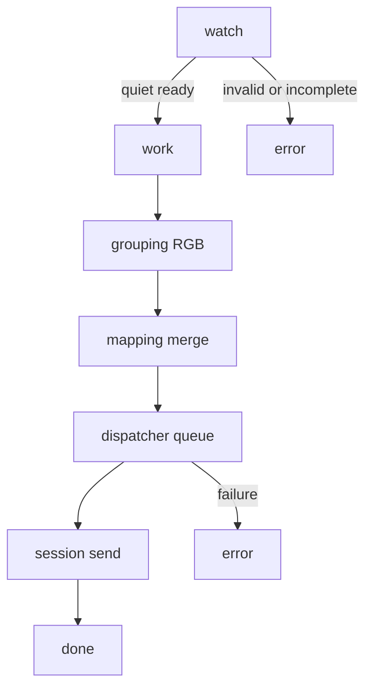
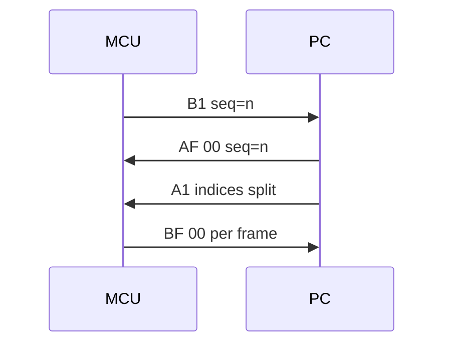
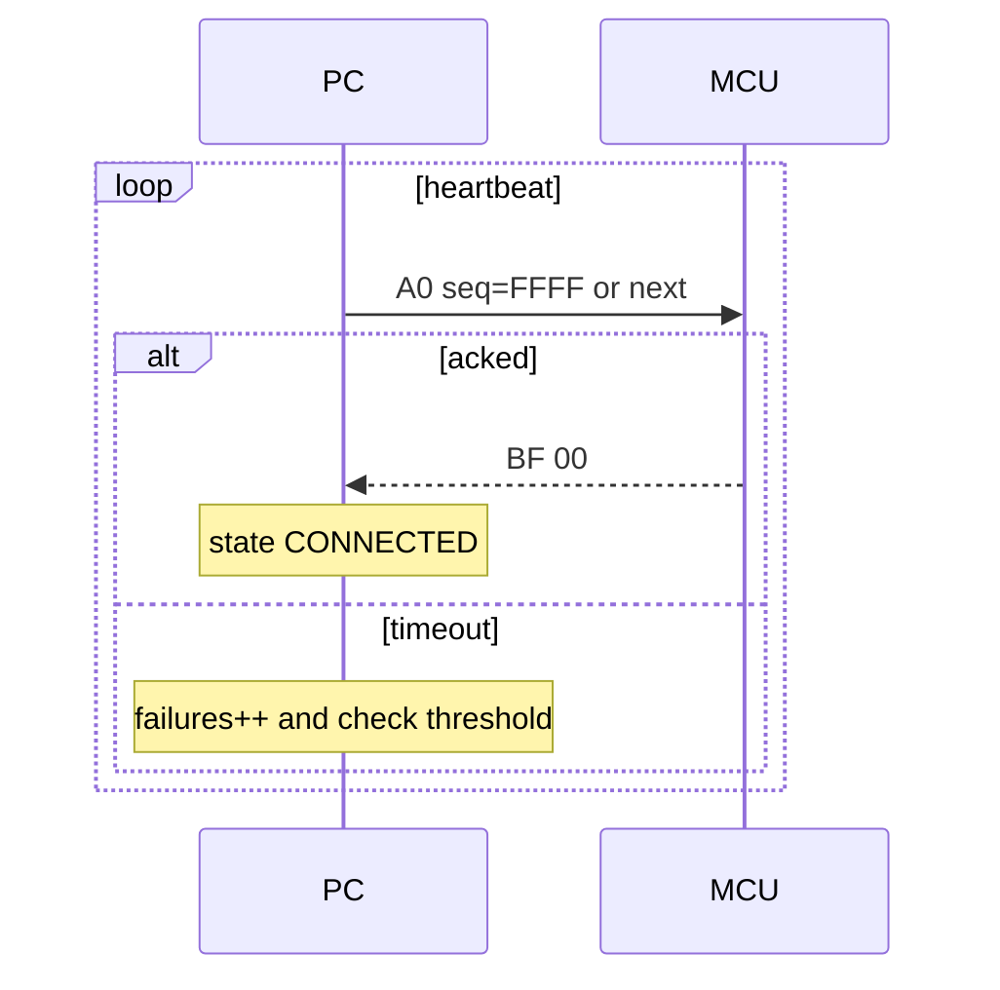

# Material Identification Upper Computer
中文上位机，面向画布配色与拣料，通过串口控制 WS2812 灯带，高亮提示仓格，降低差错并提升效率。

## 核心价值
- 文件驱动的稳健流水：安静窗口过滤半写，预检先于移动（文件名正则 + 文本解析），失败整对入 error；成功采用 .part + .pairlock 两阶段提交，最终原子落盘至 work。[ingest_batch()](app/business/file_ingress.py:41)、[_safe_move()](app/business/file_ingress.py:210)
- 自动分组三色与映射：按文件名 N1/N2/N3 聚合为 R/G/B；支持蛇形映射；闪烁由 A1 每项 2B 的最高位(MSB)承载。[GroupingService.group()](app/business/grouping.py:25)、[serpentine_map()](app/business/mapping.py:35)、[compose_indices_with_msb_for_file()](app/business/mapping.py:140)
- 串口协议一致性：固定帧格式与校验，A0/A1/AF、B0/B1/BF 完整实现。[FrameType](app/comm/protocol.py:16)、[AckCode](app/comm/protocol.py:24)、[encode_frame()](app/comm/protocol.py:49)、[decode_stream()](app/comm/protocol.py:62)
- 会话可靠性：B1 幂等与乱序处理、A1 分片、ACK 等待重试、心跳在线判定。[SerialSession](app/comm/session.py:28)、[_handle_frame()](app/comm/session.py:250)、[_send_a1_payload()](app/comm/session.py:296)、[send_and_wait_ack()](app/comm/session.py:139)、[start_heartbeat()](app/comm/session.py:194)
- 可观测性：HEX 捕获、日志级别/轮转、详细 TX/RX 打点。[get_logger()](app/logs/logger.py:24)、[hex_dump()](app/logs/logger.py:61)

## 架构一览
- 协议层：帧编解码与构造 [build_a0()](app/comm/protocol.py:112)、[build_a1()](app/comm/protocol.py:115)、[build_af()](app/comm/protocol.py:134)
- 会话层：串口收发、SEQ/ACK、重试/回退、心跳、分片。[SerialSession](app/comm/session.py:28)
- 业务层：入库/分组/映射/派发。[FileIngressService](app/business/file_ingress.py:12)、[GroupingService](app/business/grouping.py:20)、[Dispatcher](app/business/dispatcher.py:13)
- 串口与设备：抽象串口与假实现。[SerialPortBase](app/comm/serial_port.py:4)、[FakeSerialPort](app/comm/serial_port.py:26)
- 配置与日志：JSON 仓库与日志体系。[ConfigRepo](app/storage/config.py:7)、[load()](app/storage/config.py:13)、[_apply_defaults()](app/storage/config.py:22)

### 文件流水线

### B1 请求派发时序

### 心跳调度与在线判定

## 快速开始
1) 安装依赖
- Python 3.10+
- 安装 uv（推荐）：`pipx install uv` 或 `pip install uv`
- 使用 uv 同步依赖（含开发依赖）：`uv sync --dev`（将生成 uv.lock，建议提交）
- 备选（不使用 uv）：`pip install -r requirements.txt`（见 [requirements.txt](requirements.txt)）
2) 运行
- 使用 uv：`uv run -m app.main`（入口 [main()](app/main.py:6)）
- 备选：`python -m app.main`
- 预期：输出启动日志，日志路径与级别见配置 [configs/default.json](configs/default.json)
3) 目录结构要点
- 数据目录：data/watch、data/work、data/error、data/done（见 [configs/default.json](configs/default.json)）
- 日志文件：logs/app.log（见 [logging.file](configs/default.json)）
- 配置注入：通过 APP_CONFIG_PATH 指向自定义 JSON，加载见 [ConfigRepo.load()](app/storage/config.py:13)

## 配置指南
- 默认配置：见 [configs/default.json](configs/default.json)
- 动态注入：设置环境变量 APP_CONFIG_PATH 指向自定义配置文件，运行时再次读取，默认填充逻辑见 [_apply_defaults()](app/storage/config.py:22)
- 关键配置项
  - 串口通讯：serial.* 与 comm.*（心跳开关/周期、离线阈值、ACK 重试 [send_and_wait_ack()](app/comm/session.py:139)）
  - 映射布局：mapping.cols、mapping.serpentine_enabled，蛇形实现 [serpentine_map()](app/business/mapping.py:35)
  - 显示策略：display.blink_enabled、display.blink_threshold_percent；闪烁由 MSB 承载，[compose_indices_with_msb_for_file()](app/business/mapping.py:194)
  - 入库策略：ingress.ready_quiet_ms（安静窗口毫秒，默认建议 100）；预检先于移动；两阶段提交 .part + .pairlock；入库实现 [ingest_batch()](app/business/file_ingress.py:41)
  - 日志与 HEX：logging.level/rotate/* 与 logging.hex.capture，日志模块 [get_logger()](app/logs/logger.py:24)

## 数据流水线（watch→work/error→done）
- 入库：先按安静窗口筛选，然后执行合法性预检（文件名正则 + 文本解析至少 1 个有效 index）；失败整对入 error；成功通过 .part + .pairlock 两阶段提交落盘至 work。[ingest_batch()](app/business/file_ingress.py:41)
- 分组：按文件名末尾 -N1/N2/N3 聚合为 R/G/B 三色组。[GroupingService.group()](app/business/grouping.py:25)
- 映射：解析各色文本行的 index 和可选 percent，按 R→G→B 合并；蛇形重排；当 percent 超阈值置 MSB。[parse_indices_and_percent_from_txt()](app/business/mapping.py:76)、[compose_indices_with_msb_for_file()](app/business/mapping.py:194)
- 派发：设备 B1 请求后，上位机 AF(OK) → A1（可能分片）→ 每片等待 BF；成功后归档至 done，失败分流 error。[Dispatcher.request_next_payload()](app/business/dispatcher.py:35)、[_send_a1_payload()](app/comm/session.py:296)

## 通讯协议概览
- 帧结构：HEADER(4)+TYPE(1)+LEN(2)+SEQ(2)+VAL(N)+CHECK(1)，小端；CHECK 为 TYPE+LEN(LE)+SEQ(LE)+VAL 求和低 8 位。[encode_frame()](app/comm/protocol.py:49)
- 类型：上位机 A0/A1/AF；下位机 B0/B1/BF。[FrameType](app/comm/protocol.py:16)
- 应答码：00=成功；01=未知 TYPE；02=LEN 错误；03=SEQ 过小；04=SEQ 过大；05=VAL 错误；06=CHECK 错误。[AckCode](app/comm/protocol.py:24)
- 时序：B1→AF→A1→BF；空包 A0/B0 用于心跳在线判定（A0 的 SEQ=FFFF 或下一序号）。详见 [docs/通信约定.md](docs/通信约定.md)

## 会话可靠性与分片/心跳/重试
- 幂等与乱序：重复 B1 仅回 AF(DUPLICATE)；小于 expected 回 0x03，大于 expected 回 0x04，拒绝派发。处理逻辑见 [_handle_frame()](app/comm/session.py:250)
- 分片：A1 载荷按 bytes_per_frame 切片；固定 2B/项；每片等待 BF。[app/comm/protocol.py](app/comm/protocol.py)、[app/comm/session.py](app/comm/session.py)
- ACK 重试：统一在 [send_and_wait_ack()](app/comm/session.py:139) 内实现，由 comm.retry.* 驱动
- 心跳：构造时可启用后台心跳线程 [start_heartbeat()](app/comm/session.py:194)；收到任意 BF 成功视为在线，失败累计达阈值置 OFFLINE，成功后恢复 CONNECTED

## 开发与测试
- 运行测试：`pytest -q` 或 `pytest`
- 关键用例：协议正确性/错误、会话重试与心跳、分片与闪烁、入库原子性与分组、日志 HEX 捕获（见 tests/*）
  - [tests/test_protocol.py](tests/test_protocol.py)、[tests/test_protocol_errors.py](tests/test_protocol_errors.py)
  - [tests/test_session.py](tests/test_session.py)、[tests/test_session_seq_errors.py](tests/test_session_seq_errors.py)、[tests/test_session_retry.py](tests/test_session_retry.py)、[tests/test_heartbeat_scheduler.py](tests/test_heartbeat_scheduler.py)
  - [tests/test_ingress_atomic.py](tests/test_ingress_atomic.py)、[tests/test_grouping.py](tests/test_grouping.py)、[tests/test_dispatcher.py](tests/test_dispatcher.py)、[tests/test_chunking.py](tests/test_chunking.py)、[tests/test_dispatcher_blink.py](tests/test_dispatcher_blink.py)、[tests/test_logging_config.py](tests/test_logging_config.py)
- 无硬件联调：使用内存串口 [FakeSerialPort](app/comm/serial_port.py:26) 与会话 [SerialSession](app/comm/session.py:28) 模拟端到端流程

## 打包与分发
- Windows 一键脚本：运行 [scripts/build.bat](scripts/build.bat)
- 通用命令（示例）：`pyinstaller --noconfirm --clean --name MaterialUpper --onedir --console --paths . --add-data "configs;configs" --add-data "resources;resources" app/main.py`
- 产物：dist/MaterialUpper；包含配置与资源目录（按脚本参数）

## 常见问题与排障
- 半写文件：提高 [ingress.ready_quiet_ms](configs/default.json)；规范仅在 watch 为空时投放
- 离线误判：区分心跳线程内“无重试”与显式发送的重试差异；调整 comm.offline_failure_threshold 与 retry.* 参数
- 指令过长：利用会话分片；必要时下调 bytes_per_frame。[app/comm/session.py](app/comm/session.py)
- HEX 日志：开启 [logging.hex.capture](configs/default.json)，查看 [TX HEX/RX HEX] 打点，格式化函数 [hex_dump()](app/logs/logger.py:61)

## 限制与未来规划
- 串口：当前仅提供假实现 [FakeSerialPort](app/comm/serial_port.py:26)；实际串口可按 [SerialPortBase](app/comm/serial_port.py:4) 接口适配
- 打印：占位实现 [Printer](app/devices/printer.py:5)；后续接入真实热敏打印机与版式模板
- 协议扩展：attrs 更多位含义、LEN/VAL 细化错误码等，需与下位机协同演进

## 参考
- 产品/架构/技术说明： [.kilocode/rules/memory-bank/product.md](.kilocode/rules/memory-bank/product.md)、[.kilocode/rules/memory-bank/architecture.md](.kilocode/rules/memory-bank/architecture.md)、[.kilocode/rules/memory-bank/tech.md](.kilocode/rules/memory-bank/tech.md)
- 通讯约定： [docs/通信约定.md](docs/通信约定.md)
- 默认配置： [configs/default.json](configs/default.json)
- 入口： [main()](app/main.py:6)